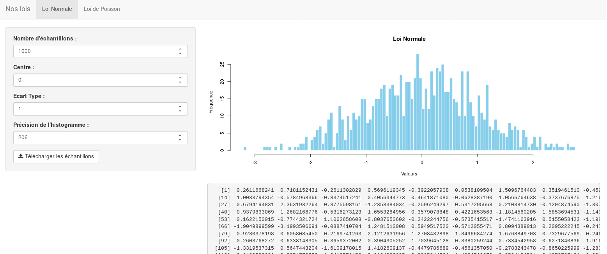
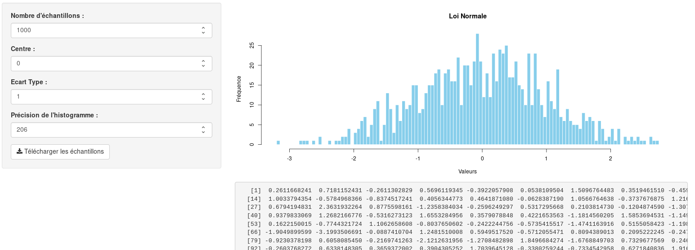
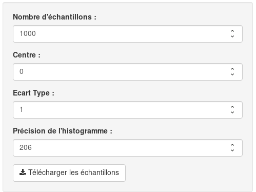
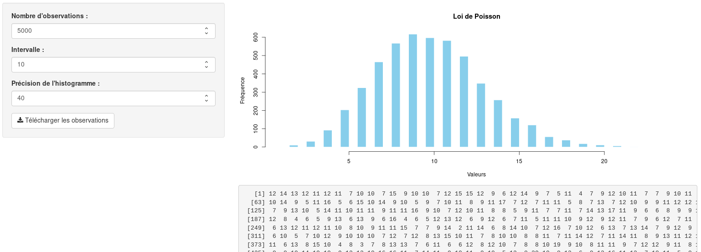
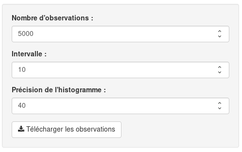

#  Projet R

Application de statistiques qui permet de générer et de visualiser les résultats issus de la Loi Normale et de la Loi de Poisson.

### Librairies

L'application utilise la librairie Shiny.

## Lancer l'application

Pour lancer l'application, il faut d'abord lancer une console R. 

Puis exécuter ces commandes:

```R
> library(shiny)
> runApp("$emplacement du projet")
```

Avec **$emplacement du projet** qui correspond à l'endroit où se situe le projet sur votre ordinateur.

## Présentation de l'application




Il est possible de chosir la Loi à étudier grâce à la barre de navigation situé en haut de l'écran.

#### Loi Normale



Pour la Loi Normale, il est possible de choisir le nombre d'échantillons à générer. Il est aussi possible de choisir un centre et un écart type. Enfin, il est possible de jouer sur la précision de l'histogramme pour un affichage plus précis.



Enfin, il est possible de télécharger au format CSV l'échantillons générer par la Loi Normale avec les paramètres définis.


#### Loi de Poisson



Concernant la Loi de Poisson, il est possible de choisir un nombre d'observations à générer. Il est aussi possible de définir un intervalle moyen des valeurs. Enfin, il est possible de jouer sur la précision de l'histogramme pour un affichage plus précis.



Un bouton permet de télécharger au format CSV les observations générés avec les paramètres définis.